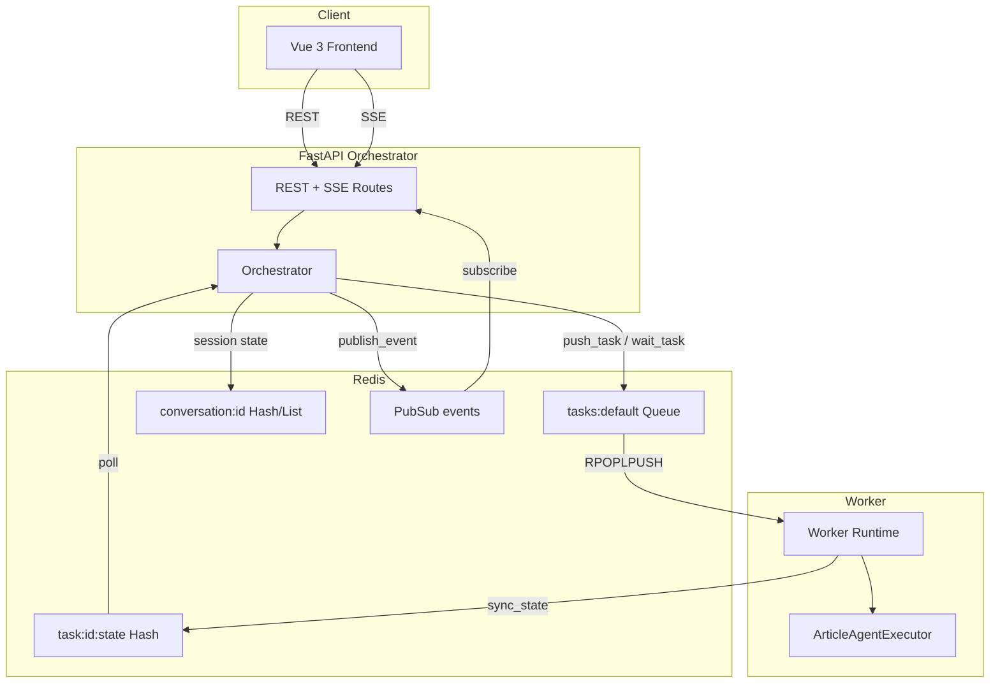
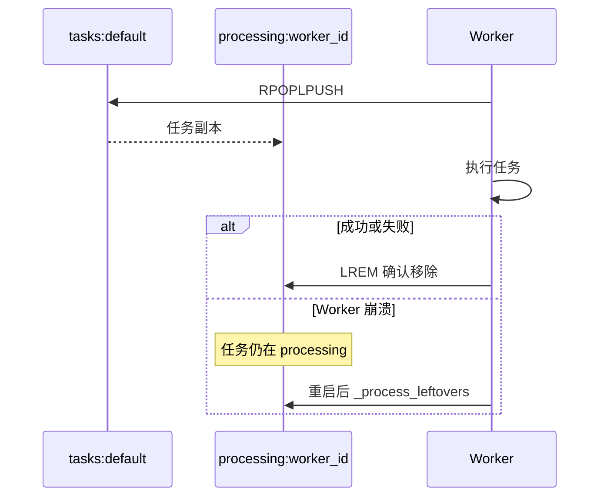
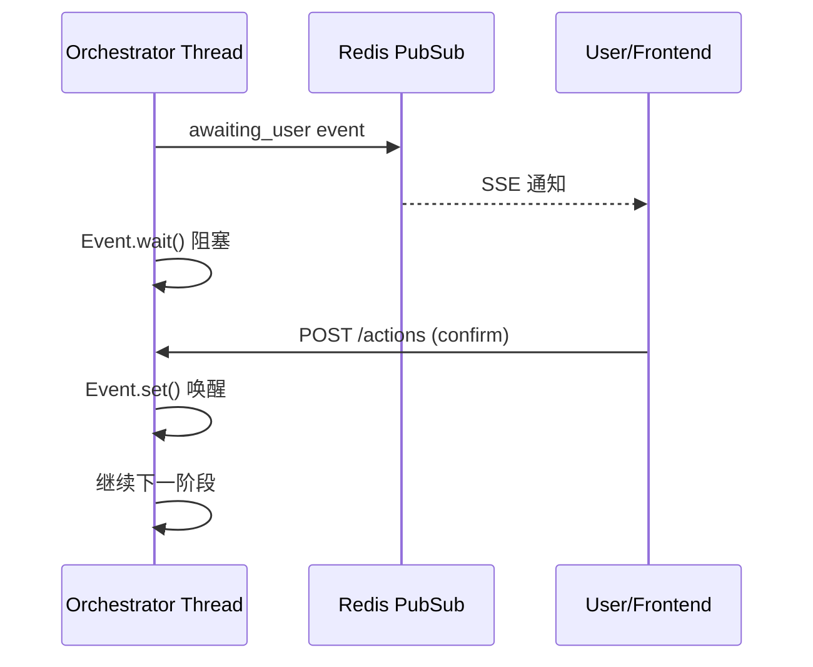

# InkSpark 后端面试技术 QA

> 面向后端岗位，基于本项目实际代码整理。  
> 每题提供 **面试版**（简短专业，可直接口述）和 **基础版**（灰色，面向基础薄弱者）。

---

## 目录

1. [项目概述](#1-项目概述)
2. [系统架构](#2-系统架构)
3. [FastAPI 与 API 设计](#3-fastapi-与-api-设计)
4. [Redis 与数据模型](#4-redis-与数据模型)
5. [任务队列与 Worker](#5-任务队列与-worker)
6. [Orchestrator 工作流编排](#6-orchestrator-工作流编排)
7. [SSE 实时推送](#7-sse-实时推送)
8. [并发与线程模型](#8-并发与线程模型)
9. [CrewAI 与 LLM 集成](#9-crewai-与-llm-集成)
10. [可靠性与错误处理](#10-可靠性与错误处理)
11. [扩展与生产化](#11-扩展与生产化)

---

## 1. 项目概述

### Q1：请用 30 秒介绍这个项目

**面试版：**  
InkSpark 是一个分布式 AI 文章创作系统。FastAPI 编排层负责会话状态和用户交互，通过 Redis 队列向 Worker 投递 CrewAI 多 Agent 任务；Worker 执行调研、大纲、撰写、审核四阶段流水线，结果回写 Redis；前端通过 REST + SSE 实时展示步骤进度，每步支持人工确认或修改。

<span style="color:#888">**基础版：** 这是一个帮你写文章的 AI 系统。你在网页上输入主题，后台有几个 AI「小助手」分工合作：先搜资料、再列大纲、再逐段写、最后审核。每一步你都可以看结果、确认或要求修改。技术上分三层：网页、API 服务器、干活的 Worker，它们通过 Redis 这个「中间人」传消息。</span>

---

### Q2：为什么选择 Redis 而不是直接调 LLM？

**面试版：**  
解耦 API 与 Worker：LLM 调用耗时长（数十秒至数分钟），同步 HTTP 会阻塞连接、超时难控。Redis 队列实现异步投递 + 状态轮询，Worker 可水平扩展，API 层专注编排与用户交互。

<span style="color:#888">**基础版：** 让 AI 写一篇文章可能要等很久。如果 API 一直等着 AI 写完再回复，浏览器会超时、服务器也扛不住。所以 API 只负责「把任务丢进队列」，Worker 慢慢做，做完把结果存到 Redis，API 再去取。</span>

---

## 2. 系统架构

### Q3：整体架构是怎样的？各层职责？

**面试版：**  
三层进程：Vue 前端 ↔ FastAPI Orchestrator ↔ Redis ↔ Worker（CrewAI）。Orchestrator 管会话级状态机（步骤、artifact、用户等待点）；Worker 无感知 Web，只消费 `tasks:default` 队列并写 `task:{id}:state`；gRPC 为可选的结果上报通道。



<span style="color:#888">**基础版：** 想象一个餐厅：前端是顾客（点菜、看进度），API 是服务员（记单、传话），Redis 是传菜窗口和公告板，Worker 是后厨（真正做菜）。顾客不直接进厨房，服务员也不亲自炒菜，大家各干各的，通过窗口协作。</span>

---

### Q4：会话级状态和任务级状态为什么要分离？

**面试版：**  
会话状态（conversation、steps、artifacts）生命周期与用户交互绑定，TTL 7 天；任务状态（task:state）与单次 Agent 执行绑定，Orchestrator 通过 `push_task` + `wait_task` 桥接两者。分离后 Worker 可独立扩展、可被多个 Producer 复用，编排逻辑变更不影响 Agent 执行层。

<span style="color:#888">**基础版：** 「写一篇完整文章」是会话，里面有很多小任务（调研一次、写一节等）。会话记录整篇文章的进度和用户选了什么；每个小任务有自己的 ID 和完成状态。分开存，以后换界面或加功能时，干活的 Worker 不用改。</span>

---

## 3. FastAPI 与 API 设计

### Q5：REST 和 SSE 如何分工？

**面试版：**  
REST 处理 CRUD 与用户动作（创建会话、启动流程、提交 confirm/revise/cancel、拉取 artifact）；SSE 单向推送步骤状态变更（`step_update`、`awaiting_user`、`conversation_done`）。用户操作用 POST 保证幂等可控，状态推送用 SSE 避免轮询开销。

<span style="color:#888">**基础版：** REST 像普通网页请求：你点按钮，发一个请求，服务器回应。SSE 像开着一条「直播通道」，服务器有新进度就主动推给你，不用你每秒刷新问「好了没」。</span>

---

### Q6：Pydantic 模型在项目里起什么作用？

**面试版：**  
`models.py` 定义请求/响应 Schema（`StartRequest`、`ActionRequest`、`StepModel` 等），FastAPI 自动校验入参、生成 OpenAPI 文档，路由层与 Redis 原始 dict 之间做类型边界。

```7:24:web/backend/models.py
class StartRequest(BaseModel):
    topic: str
    requirements: str = ""
    mode: str = "启发模式 (预览版)"
    category: str = "技术文章"
    search_scope: Dict[str, bool] = Field(default_factory=lambda: {
        "notes": False,
        "knowledge_base": False,
        "web": True,
        "literature": True,
    })


class ActionRequest(BaseModel):
    action: str  # confirm | revise | cancel
    step_id: str
    payload: Optional[Dict[str, Any]] = None
```

<span style="color:#888">**基础版：** Pydantic 像表格模板：前端必须按格式填「主题、要求」等字段，少填或填错类型，API 会直接报错，不会把脏数据传进业务逻辑。</span>

---

### Q7：为什么 export 接口返回 PlainTextResponse 而不是 JSON？

**面试版：**  
导出场景是文件下载，需设置 `Content-Disposition: attachment` 和 UTF-8 文件名（`filename*` RFC 5987）。`export_utils.py` 生成 YAML front matter + Markdown 正文，直接以 `text/markdown` 流式返回，浏览器触发下载而非内联展示。

<span style="color:#888">**基础版：** 导出是要「下载一个 .md 文件」，不是返回 JSON 给程序读。所以响应类型设成文本/Markdown，并告诉浏览器「这是附件，请保存」。</span>

---

## 4. Redis 与数据模型

### Q8：Redis 里存了哪些 Key？各用什么数据结构？

**面试版：**

| Key 模式 | 类型 | 用途 |
|----------|------|------|
| `conversation:{id}` | Hash | 会话元数据（status、topic、full_article） |
| `conversation:{id}:steps` | List | 有序步骤 JSON |
| `conversation:{id}:artifacts:{step_id}` | String | 步骤产出 Markdown |
| `conversation:{id}:events` | PubSub | SSE 事件频道 |
| `tasks:default` | List | 任务队列 |
| `task:{id}:state` | Hash | Worker 任务状态/结果 |
| `lock:{resource_id}` | String | 分布式锁 |

<span style="color:#888">**基础版：** Redis 像带标签的储物柜：Hash 适合存「名字→值」的字段（会话信息）；List 适合排队（任务队列、步骤顺序）；String 存一大段文本（文章内容）；PubSub 像广播，订阅的人都能收到消息（前端实时更新）。</span>

---

### Q9：步骤列表为什么用 List 而不是 Hash？

**面试版：**  
步骤有严格时序（research → outline → section × N → review），List 的 `RPUSH` + `LRANGE` 天然保序；更新某步时 `LSET` 按索引替换。Hash 无法表达顺序，Sorted Set 对此场景过度设计。

<span style="color:#888">**基础版：** 写文章的步骤有先后顺序，List 就像排队清单，先发生的在前面或按加入顺序排列，改某一步时找到对应位置替换即可。</span>

---

### Q10：会话 TTL 7 天，如何刷新？

**面试版：**  
`RedisStore` 在 `create_conversation`、`update_conversation`、`add_step` 等写操作后调用 `expire(key, CONVERSATION_TTL)`，活跃会话自动续期，冷数据自动回收。

```11:27:web/backend/redis_store.py
CONVERSATION_TTL = 7 * 24 * 3600


class RedisStore:
    ...
    def create_conversation(self) -> str:
        conv_id = str(uuid.uuid4())
        key = f"conversation:{conv_id}"
        self.client.hset(key, mapping={...})
        self.client.expire(key, CONVERSATION_TTL)
        return conv_id
```

<span style="color:#888">**基础版：** TTL 是「过期时间」。每次有人用这个会话（更新状态、加步骤），就重新计时 7 天；7 天没人用，Redis 自动删掉，省空间。</span>

---

## 5. 任务队列与 Worker

### Q11：RPOPLPUSH 解决了什么问题？

**面试版：**  
普通 `BLPOP` 弹出后消息即消失，Worker 崩溃则任务丢失。`RPOPLPUSH source processing` 原子地将任务移到 Worker 专属 processing 队列，处理完成 `LREM` 确认；崩溃重启后 `_process_leftovers` 从 processing 队列恢复，保证 at-least-once 投递。



<span style="color:#888">**基础版：** 从队列拿任务时，不是直接扔掉，而是先复制到「正在处理」清单。干完了再从清单划掉；如果中途电脑死机，重启后看「正在处理」清单里还有什么，继续做完。</span>

---

### Q12：分布式锁怎么实现？为什么需要心跳？

**面试版：**  
`SET lock:{task_id} worker_id NX EX 300` 实现互斥；多 Worker 抢同一任务时只有一个成功。心跳线程每 10s 刷新 `last_update` 和锁 TTL，防止长任务执行中锁过期被其他 Worker 误抢。

<span style="color:#888">**基础版：** 锁像「正在占用」牌子：谁拿到谁处理，别人不能重复做同一件事。AI 任务可能跑很久，所以每隔一会儿要「续租」锁，不然牌子过期别人以为没人做又抢走了。</span>

---

### Q13：Orchestrator 如何等待 Worker 完成？

**面试版：**  
`push_task` 将 payload 推入 `tasks:default` 并返回 task_id；`wait_task` 每秒轮询 `task:{id}:state` Hash，status 为 `completed` 则解析 result JSON 返回，`failed` 抛异常，默认 timeout 600s。

```71:96:web/backend/redis_store.py
    def push_task(self, payload: Dict[str, Any], queue: str = "tasks:default"):
        ...
        self.client.rpush(queue, json.dumps(payload, ensure_ascii=False))
        return payload["id"]

    def wait_task(self, task_id: str, timeout: int = 600) -> Optional[Dict[str, Any]]:
        ...
        while _time.time() - start < timeout:
            state = self.client.hgetall(f"task:{task_id}:state")
            if state:
                status = state.get("status")
                if status == "completed":
                    ...
                if status == "failed":
                    raise RuntimeError(...)
            _time.sleep(1)
        raise TimeoutError(...)
```

<span style="color:#888">**基础版：** API 把任务编号告诉 Redis 队列，然后每隔 1 秒去看「这个编号完成了没有」。完成了就拿结果，失败了报错，等太久就超时。</span>

---

### Q14：Worker 的幂等性如何保证？

**面试版：**  
执行前 `get_state` 检查是否已 `completed`，是则直接 ACK 跳过；加锁失败说明其他 Worker 在处理，ACK 丢弃副本。配合 RPOPLPUSH + 锁，实现重复投递下的 exactly-once 语义（业务层）。

<span style="color:#888">**基础版：** 同一张「订单」可能被误传两次。Worker 先看「这单是不是已经做完了」，做完了就不再做；如果别人正在做，自己也退出，避免两个人写同一篇文章。</span>

---

## 6. Orchestrator 工作流编排

### Q15：Orchestrator 的核心职责是什么？

**面试版：**  
实现会话级状态机：按 phase（research → outline → section → review）驱动 Worker 任务，管理 step 生命周期，在 `awaiting_user` 节点阻塞等待用户 action（confirm/revise/cancel），通过 PubSub 推送 SSE 事件，持久化 artifact。

<span style="color:#888">**基础版：** Orchestrator 是「总导演」：按剧本一步步叫 Worker 干活，每步做完暂停问用户「行不行」，用户说行才继续，说不行就带修改意见重来。</span>

---

### Q16：用户等待机制如何实现？

**面试版：**  
`_wait_user` 为每个 `(conv_id, step_id)` 创建 `threading.Event`，发布 `awaiting_user` 事件后 `event.wait(timeout)` 阻塞工作流线程；用户 POST `/actions` 触发 `submit_action` → `event.set()` 唤醒，携带 action 和 payload 继续流程。

```100:116:web/backend/orchestrator.py
    def _wait_user(self, conv_id: str, step_id: str, timeout: int = 3600) -> Dict[str, Any]:
        key = f"{conv_id}:{step_id}"
        event = threading.Event()
        self._pending[key] = event
        self._emit(conv_id, "awaiting_user", {"step_id": step_id})
        if not event.wait(timeout):
            raise TimeoutError("等待用户操作超时")
        action = self._actions.pop(key, {"action": "cancel"})
        ...

    def submit_action(self, conv_id: str, step_id: str, action: str, payload: Optional[Dict] = None):
        key = f"{conv_id}:{step_id}"
        self._actions[key] = {"action": action, "payload": payload or {}}
        ev = self._pending.get(key)
        if ev:
            ev.set()
```



<span style="color:#888">**基础版：** 工作流线程跑到「等用户」就睡觉（阻塞），前端显示「请确认」；用户点确认后，API 发信号把它叫醒，它带着用户的选择继续往下走。</span>

---

### Q17：大纲 revise 循环怎么设计？

**面试版：**  
outline 步骤进入 `awaiting_user` 后 `while True`：`confirm` 跳出；`revise` 将 feedback 追加到 requirements，重新 `push_task` 生成大纲，更新 artifact 后再次等待。section 阶段同理，每节独立 revise 循环。

<span style="color:#888">**基础版：** 大纲不满意可以一直改：你说哪里不好，系统带着你的意见重新生成，直到你点「确认」才进入写正文。</span>

---

## 7. SSE 实时推送

### Q18：为什么选 SSE 而不是 WebSocket？

**面试版：**  
步骤状态是服务端 → 客户端单向推送，无需双向通道；SSE 基于 HTTP，穿透代理/firewall 更简单，FastAPI 用 `sse-starlette` 即可；用户操作用 REST 分离关注点。WebSocket 适合高频双向（如协同编辑），本项目无此需求。

<span style="color:#888">**基础版：** 只需要服务器「通知你进度更新了」，不需要你 constantly 发消息给服务器。SSE 就是一条只读的长连接，比 WebSocket 更简单，够用。</span>

---

### Q19：SSE 断线重连如何恢复状态？

**面试版：**  
连接建立后先发 `init` 事件，携带 Redis 中完整 steps 列表和 conversation status，前端据此重建 UI；之后订阅 PubSub 增量事件。刷新页面或断线重连不会丢已完成的步骤。

```30:39:web/backend/routes/stream.py
        # Send existing state first so reconnects restore UI after refresh
        conv = store.get_conversation(conv_id) or {}
        steps = store.get_steps(conv_id)
        yield {
            "event": "init",
            "data": json.dumps(
                {"steps": steps, "status": conv.get("status", "created")},
                ensure_ascii=False,
            ),
        }
```

<span style="color:#888">**基础版：** 一连上 SSE，服务器先把「目前已经有哪些步骤、什么状态」整包发给你，再开始推送新变化。这样刷新页面也不会变成空白。</span>

---

### Q20：同步 Redis 客户端和异步 SSE 如何共存？

**面试版：**  
`redis_store.py` 用同步 `redis.Redis` 供 Orchestrator 和 REST 路由；`stream.py` 单独创建 `redis.asyncio` 客户端订阅 PubSub，在 `async def event_generator` 中 `await pubsub.get_message`，避免阻塞事件循环。两套客户端连接同一 Redis 实例，职责分离。

<span style="color:#888">**基础版：** 普通 API 用「同步」方式读写 Redis 就行；SSE 要长时间挂着不能卡住，所以用「异步」版 Redis 客户端专门收广播消息。</span>

---

## 8. 并发与线程模型

### Q21：每个会话的工作流跑在哪个线程？

**面试版：**  
`start_workflow` 启动 daemon 线程执行 `_run`，主线程（FastAPI worker）立即返回；同一会话内步骤串行，多会话并行。`_locks[conv_id]` 保护同会话的 step 更新（预留，当前单线程 per conv）。

```118:128:web/backend/orchestrator.py
    def start_workflow(self, conv_id: str, topic: str, requirements: str, mode: str, category: str):
        def run():
            try:
                self._run(conv_id, topic, requirements, mode, category)
            except Exception as e:
                ...
        t = threading.Thread(target=run, daemon=True)
        t.start()
```

<span style="color:#888">**基础版：** 用户点「开始」后，API 马上回复「已开始」，实际写文章的在后台另一个线程里慢慢跑，不会把整个网站卡住。</span>

---

### Q22：这种线程模型有什么局限？如何改进？

**面试版：**  
局限：进程内线程，API 重启丢失进行中的 workflow；`wait_task` 阻塞线程，高并发会话消耗线程池。改进：将 workflow 状态外置 Redis/Celery/Temporal，用消息驱动代替 `threading.Event`；或 asyncio + aioredis 统一异步模型。

<span style="color:#888">**基础版：** 现在工作流存在服务器内存里，重启就没了；人多了线程也不够。上线可以用 Celery、Temporal 这类「专业排期系统」把流程存数据库/Redis，更稳。</span>

---

## 9. CrewAI 与 LLM 集成

### Q23：Agent 如何配置和调度？

**面试版：**  
`config/article_agents.yaml` 定义 role/goal/backstory/tools；`article_tasks.yaml` 定义各 phase 的 Task 模板。`ArticleAgentExecutor.execute(task_data)` 按 `phase` 字段选择 Agent 和 Task，CrewAI `Crew.kickoff()` 执行；research 阶段挂载 SerperDevTool 做网络搜索。

<span style="color:#888">**基础版：** 每个 AI 角色（调研员、写手、审核）的性格和任务写在 YAML 配置文件里。Worker 收到「现在是调研阶段」，就叫「调研员」出场干活。</span>

---

### Q24：为什么用 DashScope 兼容 OpenAI 接口？

**面试版：**  
CrewAI/LangChain 生态默认 OpenAI SDK 接口；设置 `OPENAI_API_BASE=https://dashscope.aliyuncs.com/compatible-mode/v1` 和 `DASHSCOPE_API_KEY`，`ChatOpenAI` 无感切换通义千问，避免改框架代码。

<span style="color:#888">**基础版：** 很多 AI 框架默认只认 OpenAI 的调用方式。阿里云提供了「假装自己是 OpenAI」的地址，填自己的 Key 就能用国产模型，不用重写代码。</span>

---

### Q25：LLM 输出重复标题怎么处理？

**面试版：**  
Orchestrator 的 `_normalize_section_content` 用正则 strip LLM 可能重复输出的 `# 第N节 标题` 行，保证拼接 `full_article` 时标题层级一致，避免前端渲染重复 heading。

<span style="color:#888">**基础版：** AI 有时会在正文里又写一遍章节标题，代码里用规则把多余的标题行删掉，导出文章更干净。</span>

---

## 10. 可靠性与错误处理

### Q26：Worker 侧重试策略是什么？

**面试版：**  
`RetryManager` 默认 max_retries=3，指数退避；每次重试更新 state 为 `retrying` 并记录 retry_count。本地重试耗尽后 mark `failed`，Orchestrator 的 `wait_task` 收到 failed 抛异常，对应 step 标记 `failed`，会话 status 变 `failed`。

<span style="color:#888">**基础版：** 网络抖动或 AI 偶尔报错时，自动再试最多 3 次，每次多等一会儿；还不行就标记失败，界面上能看到哪一步出了问题。</span>

---

### Q27：Orchestrator 异常如何传播到前端？

**面试版：**  
工作流线程 `except` 捕获后：`update_conversation(status=failed, error=...)` + `_emit(conv_id, "error", {message})`；SSE 客户端监听 error 事件展示；未捕获异常同样走此路径，避免线程静默死亡。

<span style="color:#888">**基础版：** 后台出错不会悄悄消失，会更新会话状态并通过 SSE 推一条错误消息，用户能看到「哪里失败了」。</span>

---

### Q28：gRPC 在本项目中的角色？

**面试版：**  
Worker 完成任务后通过 `GrpcClient.report_result` 上报 SUCCESS/FAILURE，供外部监控或主服务订阅；Web 流程不依赖 gRPC，Orchestrator 直接轮询 Redis `task:state`。gRPC 为可选增强，缺失不影响核心链路。

<span style="color:#888">**基础版：** gRPC 是 Worker 向别的系统「汇报干完了」的额外通道；网页这条线只看 Redis 里的结果，没有 gRPC 也能跑。</span>

---

## 11. 扩展与生产化

### Q29：如何水平扩展 Worker？

**面试版：**  
多实例启动 `python main.py`，共享同一 Redis；`RPOPLPUSH` + 分布式锁保证同 task 只执行一次；可按队列优先级（`tasks:high/medium/low/default`）分流。瓶颈通常在 LLM API 配额而非 Worker CPU。

<span style="color:#888">**基础版：** 任务多了就多台机器一起跑 Worker，都连同一个 Redis 抢队列里的活；锁保证不会两个人做同一单。</span>

---

### Q30：当前架构的生产化短板及改进方向？

**面试版：**

| 短板 | 改进 |
|------|------|
| 会话仅存 Redis，无 DB | PostgreSQL 持久化 + Redis 作缓存 |
| 无认证鉴权 | JWT/OAuth2 + 租户隔离 |
| 进程内 workflow 线程 | Celery/Temporal 外置状态机 |
| `wait_task` 轮询 | Redis BLPOP on state channel 或 Streams |
| CORS `*` | 限制 origin |
| 无 observability | OpenTelemetry + 结构化日志 + 任务 metrics |

<span style="color:#888">**基础版：** 现在是练手/演示级：没有登录、重启可能丢进度、监控较少。真要上线需要：数据库存历史、用户登录、专业的任务调度系统、日志和报警。</span>

---

### Q31：如果让你优化 `wait_task` 轮询，怎么做？

**面试版：**  
方案一：Worker `sync_state(completed)` 时 `PUBLISH task:{id}:done`；Orchestrator 用 `BLPOP` 或 PubSub 阻塞等待，消除 1s 轮询延迟。方案二：Redis Streams + Consumer Group，支持 ack 和 pending 恢复。方案三：短任务场景保持轮询但加 exponential backoff 降低 Redis QPS。

<span style="color:#888">**基础版：** 现在是每秒问一次「好了吗」，浪费且慢。改成 Worker 做完时「喊一声」，API 听到再继续，就不用一直问了。</span>

---

### Q32：面试中如何介绍本项目的分布式架构设计？

**面试版：**  
采用 Producer-Consumer 三层架构：FastAPI Orchestrator 是会话级 Producer，按 phase 向 Redis 队列投递 Agent 任务；Worker 消费队列并写回 `task:state`；前端通过 REST 操作用户交互、SSE 订阅 PubSub 事件。可靠性靠 RPOPLPUSH 防丢消息、分布式锁防重复执行、指数退避重试与心跳续锁。核心价值：LLM 长任务与 HTTP 解耦、Worker 可水平扩展、人机协同节点可暂停/修改/继续。

<span style="color:#888">**基础版：** 可以把它讲成「前台 + 调度 + 后厨」：网页负责展示和确认，API 负责排期，Worker 负责调用 AI 干活，Redis 在中间传任务和存状态。重点强调：任务不会丢、不会重复做、用户可以中途改主意。</span>

---

## 附录：高频追问速查

| 关键词 | 一句话 |
|--------|--------|
| **RPOPLPUSH** | 原子转移任务到 processing 队列，防 Worker 崩溃丢消息 |
| **SET NX EX** | Redis 分布式锁，NX 互斥，EX 防死锁 |
| **PubSub** | 会话事件广播，驱动 SSE 实时 UI |
| **daemon thread** | 工作流线程随进程退出，不阻塞 API 启动 |
| **awaiting_user** | 人机协同节点，Event 阻塞 + REST 唤醒 |
| **phase** | research / outline / section / review 四阶段流水线 |
| **artifact** | 每步 Agent 产出，按 step_id 存 Redis String |

---

## 附录：推荐口述项目亮点（30 秒版）

1. **异步解耦**：API 与 LLM Worker 通过 Redis 队列分离，长任务不阻塞 HTTP。  
2. **可靠消费**：RPOPLPUSH + processing 队列 + 分布式锁 + 幂等检查。  
3. **人机协同**：Orchestrator 状态机在关键节点 `awaiting_user`，支持 confirm/revise/cancel。  
4. **实时体验**：SSE init 快照 + PubSub 增量推送，断线可恢复。  
5. **可扩展**：Worker 水平扩展、队列优先级、Agent 配置 YAML 化。

---

*文档版本：与项目代码同步，适用于后端面试准备。*
