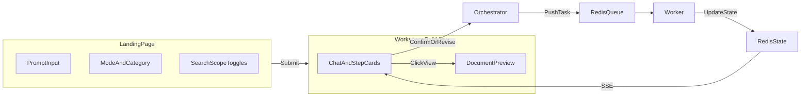

# InkSpark 创作助手 — 设计文档

## 1. 背景与目标

InkSpark 是一款基于 **Redis 任务队列 + CrewAI 多 Agent + FastAPI 编排层** 的分布式 AI 文章创作系统。用户通过 Web 界面提交创作需求，系统按流水线协作生成深度文章，并在关键节点支持人工确认或修改。

**项目目标**：

- 通用文章 / 深度报告创作
- 分步可视化流程（左侧步骤卡片 + 右侧文档预览）
- 每步可「查看」产出、可「确认/修改」后再进入下一阶段

**关键决策记录**：

| 决策项 | 选项 | 最终选择 | 理由 |
|--------|------|----------|------|
| 内容形态 | 短文 / 长文深度报告 | **深度文章** | 对齐 InkSpark 场景（如「AI 发展深度文章」） |
| 前端栈 | React / Vue / 纯模板 | **Vue 3 + Vite + Tailwind** | 适合复杂分栏交互与步骤卡片 |
| API 与 Worker | 单体 / 分离 | **分离部署** | 长任务异步化，Worker 可水平扩展 |
| 实时通信 | 轮询 / WebSocket / SSE | **SSE + REST** | 服务端单向推送步骤状态，用户操作用 REST |
| 搜索范围 | 全实现 / 部分 | **首期仅「全网」生效** | Serper 已集成；其余 Toggle 为 UI 占位 |
| 开发环境 | 系统 Python / venv / conda | **conda 独立环境 `inkspark`** | 隔离依赖，便于复现与部署 |

---

## 2. 参考 UI 说明

### 页面一：Landing（首页）

- 品牌区：InkSpark Logo + 「历史记录」
- 主视觉：打字机插图 + 「你好，创作者！」
- 输入卡片：多行 prompt、启发模式下拉、文章类型下拉
- 搜索范围：5 项 Toggle（我的笔记 / 知识库 / 全网 / 文献 / 得到App）
- 提交后进入工作区

### 页面二：Workspace（工作区）

- 顶栏：新建对话、分享
- 左栏（~40%）：对话流 + 步骤卡片（图标、标题、状态、「查看」按钮）
- 右栏（~60%）：文档预览（Markdown 渲染，含标题、章节、引用标注）
- 底栏：追加输入 + 发送
- 角色：用户「阿强」、Agent「小美/小青/小尹」

---

## 3. 系统架构

三层进程：

```
Browser (Vue 3)
    ↕ REST + SSE
FastAPI Orchestrator (web/backend)
    ↕ Redis Queue + State
Worker (main.py + CrewAI Agents)
```

**设计原则**：

- Worker 专注 Agent 任务执行，消费 `tasks:default` 队列，与 Web 层解耦
- FastAPI Orchestrator 负责会话编排、用户交互与步骤状态管理
- 会话级状态与任务级状态分离



---

## 4. 创作流水线

| Phase | 子步骤（UI 展示） | Agent | 输入 | 输出 | 用户交互点 |
|-------|-------------------|-------|------|------|-----------|
| research | 发起调研 → 深度调研 → 调研汇报 | 小美 | topic, requirements | 3 个写作角度 + 调研摘要 | 选择/确认写作角度 |
| outline | 生成文章大纲 | 小青 | chosen_direction | JSON `{title, sections[]}` | 确认或附修改意见重生成 |
| section | 逐节撰写（循环） | 小青 | section meta | Markdown 段落 | 每节确认或重写 |
| review | 审核润色 | 小尹 | full_content | 审核报告 | 确认并导出 |

---

## 5. Redis 数据模型

```
conversation:{id}                     → Hash  会话元数据
conversation:{id}:steps               → List  有序步骤 JSON
conversation:{id}:artifacts:{step_id} → String  步骤产出
conversation:{id}:events              → PubSub  会话事件频道
task:{task_id}:state                  → Hash  Worker 任务状态（已有）
tasks:default                         → List  任务队列（已有）
lock:{resource_id}                    → String 分布式锁（已有）
```

**Step 对象字段**：`step_id`, `phase`, `title`, `status`, `agent`, `artifact_key`, `detail`, `created_at`

**Status 枚举**：`pending` | `running` | `completed` | `awaiting_user` | `failed`

---

## 6. API 契约

| Method | Path | Request | Response |
|--------|------|---------|----------|
| POST | `/api/conversations` | — | `{id}` |
| GET | `/api/conversations/{id}` | — | 会话元数据 |
| POST | `/api/conversations/{id}/start` | `{topic, requirements, mode, category, search_scope}` | `{status}` |
| GET | `/api/conversations/{id}/stream` | — | SSE events |
| GET | `/api/conversations/{id}/steps` | — | `{steps: [...]}` |
| GET | `/api/conversations/{id}/artifacts/{step_id}` | — | `{content, format}` |
| POST | `/api/conversations/{id}/actions` | `{action, step_id, payload?}` | `{status}` |
| GET | `/api/conversations/{id}/export` | — | Markdown 文件下载 |

**SSE Event Types**：

- `step_update` — 步骤状态变更
- `step_completed` — 某步 Agent 执行完毕
- `awaiting_user` — 等待用户确认/修改
- `conversation_done` — 全流程结束
- `error` — 错误信息

**Action Types**：`confirm` | `revise` | `cancel`

---

## 7. 前端模块划分

| 模块 | 文件 | 职责 |
|------|------|------|
| 路由 | `router/index.ts` | `/` 首页, `/workspace/:id` 工作区 |
| 状态 | `stores/conversation.ts` | 会话、步骤、SSE、当前 artifact |
| SSE | `composables/useSSE.ts` | 连接管理、断线重连 |
| 首页 | `views/HomeView.vue` | Landing 布局 |
| 工作区 | `views/WorkspaceView.vue` | 分栏布局 |
| 步骤卡片 | `components/StepCard.vue` | 交互核心组件 |
| 文档面板 | `components/DocumentPanel.vue` | Markdown 渲染 |

---

## 8. 目录结构

```
project5_2/
├── docs/
│   ├── inkspark-design.md
│   └── backend-interview-qa.md
├── web/
│   ├── backend/
│   │   ├── main.py
│   │   ├── orchestrator.py
│   │   ├── models.py
│   │   ├── redis_store.py
│   │   └── routes/
│   └── frontend/
├── src/                     # Worker 运行时
├── extend/                  # 队列、锁、重试、gRPC、Agent 执行器
├── config/
│   ├── article_agents.yaml
│   └── article_tasks.yaml
└── main.py                  # Worker 入口
```

---

## 9. Conda 环境与启动

### 9.1 环境要求

| 组件 | 版本/说明 |
|------|-----------|
| Conda 环境名 | `inkspark` |
| Python | 3.11 |
| Redis | localhost:6379（可 Docker 或本地安装） |
| Node.js | 18+（前端，独立于 conda） |
| API Keys | `DASHSCOPE_API_KEY`、`SERPER_API_KEY`（写入 `.env`） |

### 9.2 一次性初始化

```bash
# 创建 conda 环境
conda create -n inkspark python=3.11 -y
conda activate inkspark

# 进入项目根目录
cd c:\Users\Xzq04\Desktop\project5_2

# 安装 Python 依赖
pip install -r requirements.txt
pip install fastapi "uvicorn[standard]" sse-starlette

# 配置环境变量
copy .env.example .env
# 编辑 .env，填入 DASHSCOPE_API_KEY 和 SERPER_API_KEY

# 安装前端依赖
cd web\frontend
npm install
cd ..\..
```

**或使用 environment.yml 一键创建**（实施时提供）：

```bash
conda env create -f environment.yml
conda activate inkspark
```

### 9.3 日常启动

每个 Python 终端先执行 `conda activate inkspark`，再启动对应进程：

```bash
# 终端1：Worker
conda activate inkspark
python main.py

# 终端2：Web API
conda activate inkspark
python web/backend/main.py

# 终端3：Frontend（无需 conda）
cd web\frontend
npm run dev
```

访问 `http://localhost:5173`（Vue dev server 代理 API 到 `:5000`）

### 9.4 Python 依赖清单

**已有**（`requirements.txt`）：crewai, crewai-tools, langchain_openai, redis, grpcio 等

**Web 层新增**：`fastapi`, `uvicorn[standard]`, `sse-starlette`

### 9.5 常见问题

| 问题 | 处理 |
|------|------|
| `conda: command not found` | 安装 Miniconda/Anaconda 并重启终端 |
| Redis 连接失败 | 确认 Redis 服务已启动：`redis-cli ping` 应返回 PONG |
| CrewAI 导入错误 | 确认已 `conda activate inkspark`，且 Python 为 3.11 |
| 前端无法连 API | 检查 FastAPI 是否在 :5000 运行，Vite proxy 配置是否正确 |

---

## 10. 风险与边界

| 风险 | 缓解 |
|------|------|
| Agent 执行耗时长 | SSE 推送 running 状态；前端展示进度动画 |
| 大纲 JSON 解析失败 | 保留 raw 回退 + 允许 revise 重试 |
| Redis 会话丢失 | TTL 7 天；后续可接 SQLite 持久化 |
| gRPC Server 缺失 | 不影响 Web 流程；gRPC 为可选上报 |

**首期不做**：用户登录、分享链接、历史记录 DB、非「全网」搜索源接入。

---

## 11. 验收标准

- [x] 首页 UI 还原 InkSpark Landing 核心布局
- [x] 提交 prompt 后进入工作区，左侧逐步出现步骤卡片
- [x] 每步完成后可「查看」，右侧渲染 Markdown
- [x] 调研/大纲/各节/审核四个阶段均可在 UI 确认或修改
- [x] 全流程结束可导出 `.md` 文件
- [x] Worker 崩溃后任务不丢失（Redis RPOPLPUSH 机制仍有效）

---

## 12. 相关文档

| 文档 | 说明 |
|------|------|
| [README.md](../README.md) | 项目概览、快速启动、API 索引 |
| [backend-interview-qa.md](./backend-interview-qa.md) | 后端面试技术 QA（32 题，含架构图与代码引用） |
